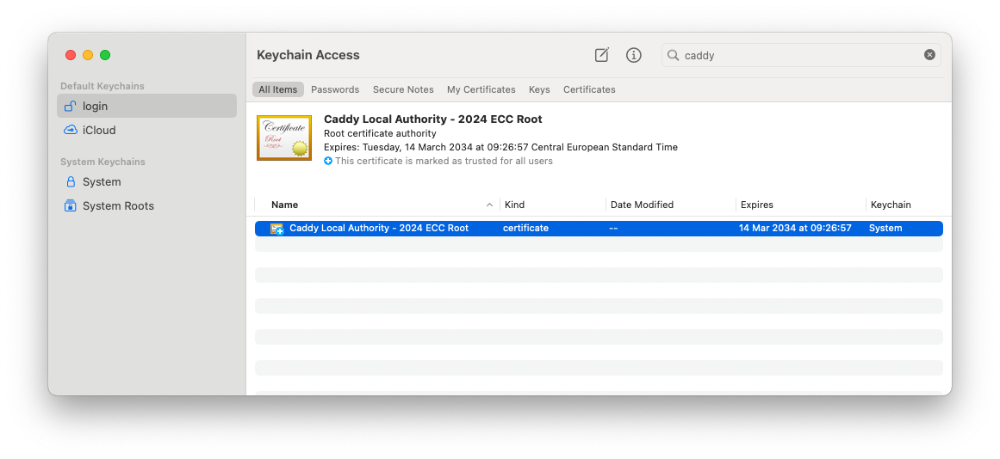

<p align="center">
<br><br>
Supporting clubs and non-profits with great software
</p>

# Versions

The main branch is currently an alpha version of Stamhoofd 2.0, which mainly is a migration to Vue 3. Changes should be synced with the V1 branch, which won't get merged into the main branch any longer.

[Stamhoofd v1 is available on the v1 branch](https://github.com/stamhoofd/stamhoofd/tree/v1). This version still uses Vue 2.

# Folder structure

We recently moved to a monorepo to make it easier for new contributors to make changes without having to work in different repositories and creating multiple pull requests. Now you can bundle all your changes in one pull request.

## Frontend 

For everything frontend related, you can take a look at the readme in the frontend folder. We have two SPA, written with Vue + TypeScript. The frontend is build on a custom (open-source) framework 'vue-app-navigation' that makes handing responsive and app-like views/navigation/animations easy. You'll see that it is easy to learn and understand.

## Backend

Documentation and code is located in the backend folder.

## Shared

We have some packages that are shared between the frontend and backend. The most important one is `structures`. This package contains all the data structures (communication in the API, stored in the backend, in an encrytped blob or in localstorage) and how they should be encoded and decoded. The data structures are versioned: when an old client communicates with an updated backend, everything will work as usual. Make sure you keep everything backwards compatible, read the documantation in [@simonbackx/simple-encoding](https://github.com/simonbackx/simple-encoding). If you need to add some new data, you'll probably need to make some changes in this package.

# Contributing

Do you want to contribute? GREAT! :D You can build features that you need for your own club or you can help the project. 

This is what you need to know:

1. Try to keep all communication in English, even when you know everyone is speaking the same language. It makes it easier for others to find answers to some questions later on and to join a conversation. We know the software is currently in Dutch only, but that will change in the future ;) 
2. We recommend you to create an issue before starting to build something (unless it is a bugfix or a small improvement, then you can open up a PR right away). Big features should be discussed first.
3. Look at the issues if you want to help build something, or open an issue if you want to help but don't know where to start. Tip: you can look at our feedback system (https://stamhoofd.nolt.io to find inspiration).
4. Create a pull request, make a draft if you feel some discussion is needed or if you want to show your WIP

## Development

### Installation

#### Git (optional, recommended)

- We recommend to use rebases locally by default: `git config --global pull.rebase true` (changes it globally, you can also configure it only for this repo)
- Git autostash on rebase:  `git config --global rebase.autoStash true` (this allows you to pull in changes or rebase when you have local changes pending)
- Git prune on fetch by default: `git config --global fetch.prune true`

#### Yarn, node and nvm

- Install nvm locally. This allows you to have multiple Node versions locally on your computer between your projects: https://github.com/nvm-sh/nvm
- Clone the repository and cd to the repository location and run `nvm install`. This installs the Node version we use at the moment for Stamhoofd and makes sure this version is used when working on Stamhoofd.
- Afterwards install yarn 2: `npm install --global yarn` - this will globally install yarn. Every time node is updated you'll need to reinstall yarn (which isn't a huge issue as it will keep the installation directory clean).
- Set the yarn version used to the one used by the project by running `yarn policies set-version 1.22.19`, you can find the exact version in package.json → engines.yarn. We currently use version version 1.22.19 of yarn because of a bug in workspaces after that version (https://github.com/yarnpkg/yarn/issues/7807).
- Run `yarn install`

#### Dependencies

Using MacOS or Linux is recommended. Setup using WSL can be very difficult given that Stamhoofd requires you to setup a local DNS server and trust a new local SSL root certificate, which is very hard to setup given that this cannot get automated by the used tools when using WSL.

- Install MySQL8 and create a new local database

```
brew install mysql
brew services mysql start
mysql -u root
```

```sql
ALTER USER 'root'@'localhost' IDENTIFIED WITH mysql_native_password BY 'root';
FLUSH PRIVILEGES;
CREATE DATABASE `stamhoofd` DEFAULT CHARACTER SET = `utf8mb4` DEFAULT COLLATE = `utf8mb4_0900_ai_ci`;
```

```
exit
```

- Install Caddy (`brew install caddy` - do not start it in the background)
- Install CoreDNS (`brew install coredns`) and start coredns via `yarn dns` (this makes sure the default development domains resolve to your local IP address, this is required because we need wildcard domains).
- Update your computer's DNS-server to 127.0.0.1 (in case coredns is not running). On MacOS when using Wi-Fi you can run  `networksetup -setdnsservers Wi-Fi 127.0.0.1`. Run `networksetup -listallnetworkservices` to list all your network services. Don't forget to remove this again if you stop coredns again (or you won't have any internet connection since all DNS queries will fail). You can also manually go to the network settings of your Mac to change the DNS server.

#### Environments

- Make sure you create all `/backend/app/*/.env.json` based on `/backend/app/*/.env.template.json` (make sure you create the required MySQL8 database and start MySQL)
- Make sure you create `/frontend/.env.json` based on `/frontend/.env.template.json`
- Make sure you create `/.development/.env` based on `/.development/.env.template` (this is the DNS record value that will be used for the A records on all domains ending with *.stamhoofd, and should point to your local computer. You can use 127.0.0.1 or your local LAN address if you want to debug on other local devices)

#### VSCode (optional)

- Install all needed vscode extensions: vetur & eslint. Please use VSCode because that makes sure all the developer tools are the same (e.g. eslint).

### Building locally

To run everything locally, we run everything on a fake TLD domain and host the dashboard on dashboard.stamhoofd. We use Caddy and Coredns to wire everything together. You can follow the following steps to run everything:

1. When switching branches, cloning the repo or when pulling changes, run `yarn install && yarn build` first in the project root
2. Use `yarn build:shared` in the project directory to build all shared dependencies inside the project. This will make sure eslint works correctly.
3. Run migrations by running `yarn migrate` in the root folder
4. Run `yarn dev`. This will start all servers. If something fails, try to run it again and/or fix the error.
5. Run caddy via `yarn caddy` (this serves the app on the default development domains). It might prompt for a password to install the root certificate for self-signed certificates the first time.
6. Start coredns via `yarn dns` (this makes sure the default development domains resolve to your local IP address, this is required because we need wildcard domains).
7. Next time you can run `yarn dev`, `yarn caddy` and `yarn dns` in one go by running `yarn dev:server`

Everything should run fine now and you should be able to visit `https://dashboard.stamhoofd` (make sure to enter http(s):// manually because the browser won't recognize the TLD by default and will default to search otherwise) to create your first organization. You should **not** get a certificate error. Never manually trust an individual certificate, this won't work as Stamhoofd requires multiple certificates and browsers tend to forget you've manually added them as an exception. On top of that browsers won't ask the question for the api domains. Follow the steps in 'Firefox' if you need to trust the certificates on Firefox.

Feel free to contact us via hello@stamhoofd.be if you have questions about development and how to set it up.

#### Firefox

Firefox does not use the root SSL certificates of your system so you have to add it manually. First make sure you have ran `caddy trust` at least once or have run `yarn caddy` succesfully (this makes sure Caddy created the root certificate). Open the Keychain app on MacOS. Search for 'Caddy' in your login keychain. 



Select it. Click File > Export Items and export it as .cer. 

In Firefox, go to Settings > Privacy and security. Scroll down to certificates. Open Certificates. In the Organization tab, click 'Import' and import the root certificate you just exported. Choose to trust it for websites. All Caddy certificates are now trusted in Firefox.

### E-mails

Stamhoofd bundles with maildev to test emails in development. This is automatically started when using the `yarn dev:server` command or `yarn mail` manually. This starts an SMTP server and web client at `http://0.0.0.0:1080/` (to see all incoming emails).

### Backend

Use these commands in `/backend`

<dl>
  <dt><code>yarn build</code></dt>
  <dd>Build the backend into the /dist folder, using TypeScript cache if possible.</dd>
  <dt><code>yarn build:full</code></dt>
  <dd>Build the backend into the /dist folder, clearing cache before building</dd>
  <dt><code>yarn start</code></dt>
  <dd>Run the backend server locally. This will use the <code>/backend/.env</code> file for configuration. You can use .env.template to create your own .env file.</dd>
  <dt><code>yarn migrations</code></dt>
  <dd>Run all the migrations. If you don't have the tables in your database, this will also create all the tables. You'll need to create the database yourself (choose your connection details and name in .env)</dd>

  <dt><code>yarn test</code></dt>
  <dd>Run the tests on a separate test database. You'll need to setup .env.test (same as .env, but please modify it first and make sure <code>NODE_ENV=test</code> is in it)</dd>
</dl>

### Frontend

You can use the following commands in both `/frontend/app/registration` and `/frontend/app/dashboard` (the current frontend apps)

<dl>
  <dt><code>yarn build</code></dt>
  <dd>Build the whole app into /dist, without optimizations (for development)</dd>

  <dt><code>yarn build:production</code></dt>
  <dd>Build the whole app into /dist, with optimizations</dd>

  <dt><code>yarn serve</code></dt>
  <dd>Serve the frontend locally with HMR (use this for development in combination with <code>yarn start</code> in the backend)</dd>
</dl>

### Shared dependencies

All shared dependencies are located in /shared. These packages are used by the backend and the frontend. If you make changes here, you must rebuild the package with `yarn build`. You can rebuild them all at once by running the same command in the project root.

# Support and information

Feedback and ideas:
<a title="Feedback" role="link" href="https://stamhoofd.nolt.io">Feedback</a> (use this for feature suggestions instead of issues)

More info on our website:
<a title="Stamhoofd" role="link" rel="author" href="https://www.stamhoofd.be/">Stamhoofd</a>

# Localizations and translations

*Translations are still WIP, not all strings are ported to the translations files yet. Feel free to contribute here!*

Translations are stored inside the package shared/locales. They need to get build (`cd shared/locales && yarn build`), because we use one single .json file to store each locale (this makes it easier to use developer and translation tools). Before we use those in the frontend, we need to filter out unused translations to save some bandwidth, that is what happens in the build step. Translations are divided in 4 namespaces: shared, dashboard, registration and webshop. The shared namespace is always loaded. For the dashboard frontend, only the dashboard namespace is loaded etc. After the build step, we have 4 JSON files (one for each namespace) for each locale. The frontend and backend knows which file to load.

The possible language / country combinations are not restricted. E.g. en-NL is still a valid locale, for users from the Netherlands who want to use the English version.

Translations are resolved in the following order: en-NL > en. So translations from a specific language + country combination are used before the translation for a given language. Try to define most translations only in the language.json file, only  country specific translations should be placed in the full locale files.

# License

Stamhoofd is open-source software, licensed under the GNU Affero General Public License Version 3 (AGPLv3). <a href="https://github.com/stamhoofd/stamhoofd/blob/development/LICENSE">View license.</a>
