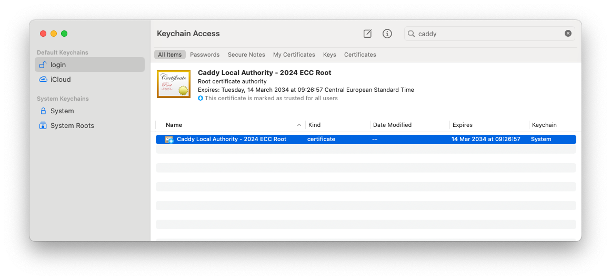

<p align="center">
<br><br>
Supporting clubs and non-profits with great software
</p>

# Versions

The main branch is currently an alpha version of Stamhoofd 2.0, which mainly is a migration to Vue 3. Changes should be synced with the V1 branch, which won't get merged into the main branch any longer.

[Stamhoofd v1 is available on the v1 branch](https://github.com/stamhoofd/stamhoofd/tree/v1). This version still uses Vue 2.

# Folder structure

We recently moved to a monorepo to make it easier for new contributors to make changes without having to work in different repositories and creating multiple pull requests. Now you can bundle all your changes in one pull request.

## Frontend 

For everything frontend related, you can take a look at the readme in the frontend folder. We have two SPA, written with Vue + TypeScript. The frontend is build on a custom (open-source) framework 'vue-app-navigation' that makes handing responsive and app-like views/navigation/animations easy. You'll see that it is easy to learn and understand.

## Backend

Documentation and code is located in the backend folder.

## Shared

We have some packages that are shared between the frontend and backend. The most important one is `structures`. This package contains all the data structures (communication in the API, stored in the backend, in an encrytped blob or in localstorage) and how they should be encoded and decoded. The data structures are versioned: when an old client communicates with an updated backend, everything will work as usual. If you need to add some new data, you'll probably need to make some changes in this package. Read the documantation about encoding, decoding, structures, patching, and versioning [here](https://stamhoofd.notion.site/). 

# Contributing

Do you want to contribute? GREAT! :D You can build features that you need for your own club or you can help the project. 

1. Drop us an email (support@stamhoofd.be) if you are interested, have an idea you want to build yourself... We can't allow all changes to the code, so it is better we can discuss this upfront. Tip: you can look at our feedback system (https://stamhoofd.nolt.io to find inspiration).
2. Read our developer documentation and try to install Stamhoofd locally on your computer
3. For larger features you'll need to document how you want to build something, and specifically where in the codebase. This will help save your some time and allows for feedback earlier.
4. Create a pull request, make a draft if you feel some discussion is needed or if you want to show your WIP

## Development

### Developer documentation

You can read the documentation of the most important building blocks of Stamhoofd [here](https://stamhoofd.notion.site/). We have some internal libraries, and those are all covered in the docs. Find something missing? Feel free to let us know.

### Installation

#### Git (optional, recommended)

- We recommend to use rebases locally by default: `git config --global pull.rebase true` (changes it globally, you can also configure it only for this repo)
- Git autostash on rebase:  `git config --global rebase.autoStash true` (this allows you to pull in changes or rebase when you have local changes pending)
- Git prune on fetch by default: `git config --global fetch.prune true`

#### pnpm, node and nvm

- Install nvm locally. This allows you to have multiple Node versions locally on your computer between your projects: https://github.com/nvm-sh/nvm
- Clone the repository and cd to the repository location and run `nvm install`. This installs the Node version we use at the moment for Stamhoofd and makes sure this version is used when working on Stamhoofd.
- Afterwards install pnpm: `npm install --global pnpm`.
- Run `pnpm install`

Using MacOS or Linux is recommended. Setup using WSL can be difficult because Stamhoofd relies on local DNS and trusted local HTTPS certificates.

#### Optional dependencies

These dependencies are optional, and mostly used for internal development.

- [Stripe CLI](https://docs.stripe.com/stripe-cli): for local webhooks
- [1Password CLI](https://developer.1password.com/docs/cli/get-started/): for using secrets in your dev environment

#### Environments

Use `STAMHOOFD_ENV=<name>` to run another local environment:

```bash
STAMHOOFD_ENV=keeo pnpm dev
STAMHOOFD_ENV=ravot pnpm dev
```

#### VSCode (optional)

- Install all needed vscode extensions: [Vue - Official](https://marketplace.visualstudio.com/items?itemName=Vue.volar), [eslint](https://marketplace.visualstudio.com/items?itemName=dbaeumer.vscode-eslint) and [i18n Ally](https://marketplace.visualstudio.com/items?itemName=Lokalise.i18n-ally). Please use VSCode because that makes sure all the developer tools are the same (e.g. eslint).

### Building locally

To run everything locally, use:

```bash
pnpm dev
```

You should not get a certificate error once local DNS and Caddy trust are configured correctly. Never manually trust an individual certificate.

Feel free to contact us via hello@stamhoofd.be if you have questions about development and how to set it up.

#### Firefox

Firefox does not always use the root SSL certificates of your system. If Firefox still shows certificate errors, open the Keychain app on MacOS and search for 'Caddy' in your login keychain.



Select it. Click File > Export Items and export it as .cer. 

In Firefox, go to Settings > Privacy and security. Scroll down to certificates. Open Certificates. In the Organization tab, click 'Import' and import the exported root certificate. Choose to trust it for websites. All Caddy certificates are now trusted in Firefox.

### E-mails

Stamhoofd bundles with MailDev to test emails in development. This is started when running the local development environment.

### Backend

Use these commands in `/backend`

<dl>
  <dt><code>pnpm build</code></dt>
  <dd>Build the backend into the /dist folder, using TypeScript cache if possible.</dd>
  <dt><code>pnpm build:full</code></dt>
  <dd>Build the backend into the /dist folder, clearing cache before building</dd>
  <dt><code>pnpm start</code></dt>
  <dd>Run the backend server locally. This will use the <code>/backend/.env</code> file for configuration. You can use .env.template to create your own .env file.</dd>
  <dt><code>STAMHOOFD_ENV=stamhoofd/keeo/ravot/... pnpm migrations</code></dt>
  <dd>Run all the migrations. If you don't have the tables in your database, this will also create all the tables. You'll need to create the database yourself (choose your connection details and name in .env)</dd>

  <dt><code>pnpm test</code></dt>
  <dd>Run the tests on a separate test database. You'll need to setup .env.test (same as .env, but please modify it first and make sure <code>NODE_ENV=test</code> is in it)</dd>
</dl>

### Frontend

You can use the following commands in both `/frontend/app/registration` and `/frontend/app/dashboard` (the current frontend apps)

<dl>
  <dt><code>pnpm build</code></dt>
  <dd>Build the whole app into /dist, without optimizations (for development)</dd>

  <dt><code>pnpm build:production</code></dt>
  <dd>Build the whole app into /dist, with optimizations</dd>

  <dt><code>pnpm dev</code></dt>
  <dd>Serve the frontend locally with HMR (use this for development in combination with <code>pnpm start</code> in the backend)</dd>
</dl>

### Shared dependencies

All shared dependencies are located in /shared. These packages are used by the backend and the frontend. If you make changes here, you must rebuild the package with `pnpm build:shared`. You can rebuild them all at once by running the same command in the project root.

# Support and information

Feedback and ideas:
<a title="Feedback" role="link" href="https://stamhoofd.nolt.io">Feedback</a> (use this for feature suggestions instead of issues)

More info on our website:
<a title="Stamhoofd" role="link" rel="author" href="https://www.stamhoofd.be/">Stamhoofd</a>

# Localizations and translations

*Translations are still WIP, not all strings are ported to the translations files yet. Feel free to contribute here!*

Translations are stored inside the package shared/locales. They need to get build (`pnpm --dir shared/locales build`), because we use one single .json file to store each locale (this makes it easier to use developer and translation tools). Before we use those in the frontend, we need to filter out unused translations to save some bandwidth, that is what happens in the build step. Translations are divided in 4 namespaces: shared, dashboard, registration and webshop. The shared namespace is always loaded. For the dashboard frontend, only the dashboard namespace is loaded etc. After the build step, we have 4 JSON files (one for each namespace) for each locale. The frontend and backend knows which file to load.

The possible language / country combinations are not restricted. E.g. en-NL is still a valid locale, for users from the Netherlands who want to use the English version.

Translations are resolved in the following order: en-NL > en. So translations from a specific language + country combination are used before the translation for a given language. Try to define most translations only in the language.json file, only  country specific translations should be placed in the full locale files.

The keys of the translations are uuids. A new translation can be added by writing $t('new translation value') in a .vue or .ts file. Running `pnpm translate` from the root will add the translation to the shared/locales .json files (of the main locales) and will replace the key with a new uuid. The main locales are specified in the `.env` folder of the i18n-uuid package in the .development directory. The .env file in the i18n-uuid directory should contain all required variables (see `.env.template`):
- `I18NUUID_DEFAULT_LOCALE`: default locale (e.g. nl)

# License

Stamhoofd may be used freely by non-profits, as outlined in the license in [LICENSE.md](LICENSE.md).
